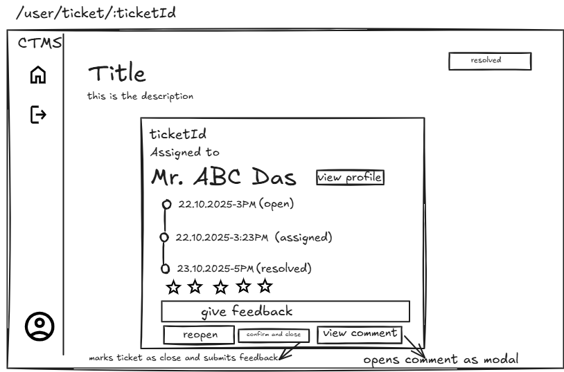
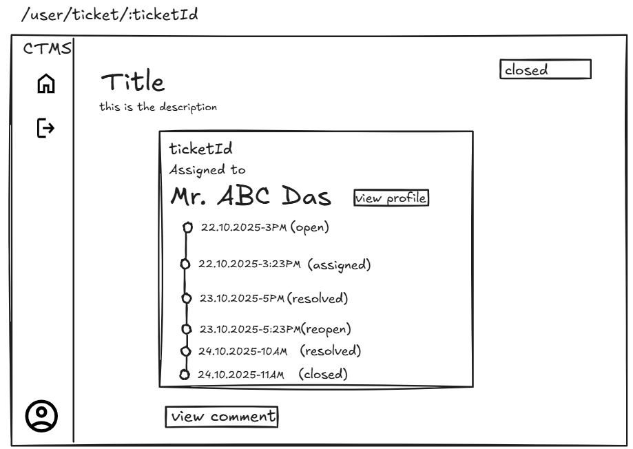

# **Project Planning Document (PPD)**

### **Project Title:** Complaint & Ticket Management System (CTMS)

### **Developer:** _Sarnick Chakraborty_

### **Docs Submission Date:** _24.10.2025_

### **Project Submission Date:** _07.11.2025_

---

## **1. Project Overview**

The **Complaint & Ticket Management System (CTMS)** is a web-based platform that streamlines the process of recording, tracking, and resolving complaints or service requests within an organization.

Each complaint raised by a user is converted into a **ticket** that moves through a **defined lifecycle** — from creation to closure — ensuring transparency, accountability, and faster resolutions.

---

## **2. Business Model & Value Proposition**

The CTMS is designed to centralize all service complaints and automate their tracking, eliminating the inefficiencies of handling issues through emails, phone calls, or spreadsheets.

| Stakeholder                        | Why They’ll Use CTMS                                                                                                                         | Problems It Solves                                                   |
| ---------------------------------- | -------------------------------------------------------------------------------------------------------------------------------------------- | -------------------------------------------------------------------- |
| **End Users / Customers**          | - Easily raise complaints. - Track live status and get automatic updates. - Provide feedback or reopen tickets if unsatisfied.         | - Lack of transparency - Delayed responses - Manual follow-ups |
| **Support Agents / Service Teams** | - Manage all assigned tickets in one place. - Add ETAs, comments, and resolution updates. - Improve collaboration with internal notes. | - Work confusion - Time loss - Poor communication              |
| **Admin / Management**             | - Monitor workload and agent performance. - View real-time reports and SLA metrics. - Improve accountability and service quality.      | - Poor visibility - Missed deadlines - No performance tracking |

---

## **3. Entities & Roles**

| Entity            | Capabilities                                                                                |
| ----------------- | ------------------------------------------------------------------------------------------- |
| **User**          | Register → Login → Raise Complaint → Track Ticket → Provide Feedback / Reopen if unresolved |
| **Support Agent** | View Assigned Tickets → Add ETA → Update Status → Add Comments → Resolve Ticket             |
| **Admin**         | Manage Users/Agents → Assign Tickets → Set Priority → Monitor Reports & Ticket Lifecycle    |

---

## **4. Workflow**

1. **User registers & logs in**

   - Raises a complaint → system auto-generates a **ticket** with **Open** status.

2. **Admin dashboard**

   - Sees all new tickets.
   - Assigns to a support agent and sets **priority** (Low/Medium/High).

3. **Agent dashboard**

   - Sees assigned tickets.
   - Adds **ETA** (Expected Resolution Time).
   - Updates ticket status:

     - **Assigned → In Progress → Resolved**

   - Adds **comments** (public or internal).

4. **User dashboard**

   - Views ticket status and ETA in real time.
   - Once ticket is **Resolved**, the user can:

     - Submit **feedback** → system auto-closes ticket → status **Closed**
     - OR click **Reopen** → status changes to **Reopened**

5. **Admin reports**

   - Admins monitor performance via dashboards showing ticket statistics, SLA breaches, feedback scores, and average resolution time.

## 

## **5. Modules**

### Backend Phase

| Phase | Task                                       | Description                                          | Actors Involved    | ETA                         |
| ----- | ------------------------------------------ | ---------------------------------------------------- | ------------------ | --------------------------- |
| 1     | **User Authentication**                    | Register/Login, JWT/session, role-based access       | User, Admin, Agent | **Thu 23 Oct – Fri 24 Oct** |
| 2     | **Ticket Management (User Dashboard API)** | CRUD for tickets, reopen flow, feedback endpoints    | User               | **Mon 27 Oct – Tue 28 Oct** |
| 3     | **Admin Dashboard API**                    | Assign agents, set ticket priority, view all tickets | Admin              | **Wed 29 Oct**              |
| 4     | **Agent Dashboard API**                    | Manage assigned tickets, comments, ETA updates       | Agent              | **Thu 30 Oct**              |
| 5     | **Feedback & Reports Backend**             | Auto-close, SLA metrics, analytics aggregation       | System, Admin      | **Fri 31 Oct**              |

### Frontend Phase

| Phase | Task                           | Description                                         | Actors Involved    | ETA           |
| ----- | ------------------------------ | --------------------------------------------------- | ------------------ | ------------- |
| 6     | **User Authentication (UI)**   | Login/Register screens, validation, API integration | User, Admin, Agent | **Mon 3 Nov** |
| 7     | **User Dashboard UI**          | Raise tickets, track status, feedback modal         | User               | **Tue 4 Nov** |
| 8     | **Admin Dashboard UI**         | Ticket table, assignment, priority controls         | Admin              | **Wed 5 Nov** |
| 9     | **Agent Dashboard UI**         | View assigned tickets, comment/ETA inputs           | Agent              | **Thu 6 Nov** |
| 10    | **Reports & Feedback UI + QA** | Charts, metrics, feedback summary, bug fixes        | Admin, System      | **Fri 7 Nov** |

---

## **6. Entities and Relationships (ER Diagram)**

### **1. User**

| Attribute  | Type         | Description                                |
| ---------- | ------------ | ------------------------------------------ |
| user_id    | INT (PK)     | Primary key                                |
| name       | VARCHAR(100) | Full name                                  |
| email      | VARCHAR(255) | Unique email                               |
| password   | VARCHAR(255) | Encrypted password                         |
| role       | ENUM         | Role: `employee`, `admin`, `support_agent` |
| is_active  | BOOLEAN      | Account active/inactive                    |
| created_at | TIMESTAMP    | Creation timestamp                         |
| updated_at | TIMESTAMP    | Last update timestamp                      |

**Relationships:**

- One-to-Many → Ticket (as employee: raises tickets)
- One-to-Many → Ticket (as agent: handles tickets)
- One-to-Many → Feedback (as employee: provides feedback)
- One-to-Many → AgentComment (as agent: adds comments)

---

### **2. Ticket**

| Attribute   | Type         | Description                                                         |
| ----------- | ------------ | ------------------------------------------------------------------- |
| ticket_id   | INT (PK)     | Primary key                                                         |
| title       | VARCHAR(255) | Ticket title                                                        |
| description | TEXT         | Complaint details                                                   |
| status      | ENUM         | `Open`, `Assigned`, `In Progress`, `Resolved`, `Reopened`, `Closed` |
| priority    | ENUM         | `Low`, `Medium`, `High`                                             |
| eta         | DATETIME     | Estimated resolution time                                           |
| created_by  | INT (FK)     | User who raised it                                                  |
| assigned_to | INT (FK)     | Assigned agent                                                      |
| created_at  | TIMESTAMP    | Creation timestamp                                                  |
| updated_at  | TIMESTAMP    | Last update timestamp                                               |
| assigned_at | TIMESTAMP    | When ticket was assigned                                            |
| resolved_at | TIMESTAMP    | When marked as resolved                                             |
| reopened_at | TIMESTAMP    | When reopened                                                       |
| closed_at   | TIMESTAMP    | When closed                                                         |

**Relationships:**

- Many-to-One → User (created_by)
- Many-to-One → User (assigned_to)
- One-to-One → Feedback
- One-to-Many → AgentComment

---

### **3. Feedback**

| Attribute   | Type      | Description           |
| ----------- | --------- | --------------------- |
| feedback_id | INT (PK)  | Primary key           |
| rating      | INT       | 1–5 scale             |
| comment     | TEXT      | Optional text         |
| ticket_id   | INT (FK)  | Associated ticket     |
| user_id     | INT (FK)  | Feedback author       |
| created_at  | TIMESTAMP | Creation timestamp    |
| updated_at  | TIMESTAMP | Last update timestamp |

**Relationships:**

- One-to-One → Ticket
- Many-to-One → User

---

### **4. AgentComment**

| Attribute  | Type      | Description           |
| ---------- | --------- | --------------------- |
| comment_id | INT (PK)  | Primary key           |
| ticket_id  | INT (FK)  | Related ticket        |
| user_id    | INT (FK)  | Agent who commented   |
| comment    | TEXT      | Comment text          |
| created_at | TIMESTAMP | Creation timestamp    |
| updated_at | TIMESTAMP | Last update timestamp |

**Relationships:**

- Many-to-One → Ticket
- Many-to-One → User (agent)

---

## **7. ER Diagram**

---

## **8. API Endpoints Design**

### **Authentication Routes**

| Method     | Endpoint           | Description              | Access        | Request Body                      | Response                   |
| ---------- | ------------------ | ------------------------ | ------------- | --------------------------------- | -------------------------- |
| **POST**   | `/api/v1/register` | Register new user        | Public        | `{ name, email, password, role }` | `{ success, user }`        |
| **POST**   | `/api/v1/login`    | Login user/admin/agent   | Public        | `{ email, password }`             | `{ success, token, user }` |
| **POST**   | `/api/v1/logout`   | Logout user              | Authenticated | -                                 | `{ success, message }`     |
| **GET**    | `/api/v1/me`       | Get current user profile | Authenticated | -                                 | `{ success, user }`        |
| **PUT**    | `/api/v1/edit`     | Update user profile      | Authenticated | `{ name, email }`                 | `{ success, user }`        |
| **DELETE** | `/api/v1/delete`   | Delete user profile      | Authenticated | -                                 | `{ success, message }`     |

---

### **Ticket Routes**

| Method     | Endpoint                            | Description                            | Access           | Request Body                | Response                        |
| ---------- | ----------------------------------- | -------------------------------------- | ---------------- | --------------------------- | ------------------------------- |
| **POST**   | `/api/v1/tickets`                   | Create new ticket                      | User             | `{ title, description }`    | `{ success, ticket }`           |
| **GET**    | `/api/v1/tickets`                   | Get all tickets                        | Role-based       | -                           | `{ success, tickets }`          |
| **GET**    | `/api/v1/tickets/:id`               | Get ticket details                     | User/Admin/Agent | -                           | `{ success, ticket, comments }` |
| **PUT**    | `/api/v1/tickets/:id`               | Update ticket                          | Creator/Admin    | `{ title, description }`    | `{ success, ticket }`           |
| **DELETE** | `/api/v1/tickets/:id`               | Delete ticket                          | Admin            | -                           | `{ success, message }`          |
| **PUT**    | `/api/v1/tickets/:id/assign`        | Assign agent & set priority            | Admin            | `{ assigned_to, priority }` | `{ success, ticket }`           |
| **PUT**    | `/api/v1/tickets/:id/update-status` | Update status (In Progress / Resolved) | Agent            | `{ status }`                | `{ success, ticket }`           |
| **PUT**    | `/api/v1/tickets/:id/add-eta`       | Add/update ETA                         | Agent            | `{ eta }`                   | `{ success, ticket }`           |
| **PUT**    | `/api/v1/tickets/:id/close`         | Close ticket (manual or system)        | Admin/System     | -                           | `{ success, ticket }`           |
| **PUT**    | `/api/v1/tickets/:id/reopen`        | Reopen resolved/closed ticket          | User             | `{ reason }`                | `{ success, ticket }`           |
| **GET**    | `/api/v1/tickets/my-tickets`        | Tickets created by user                | User             | -                           | `{ success, tickets }`          |
| **GET**    | `/api/v1/tickets/assigned-to-me`    | Tickets assigned to agent              | Agent            | -                           | `{ success, tickets }`          |

---

### **Comment Routes**

| Method     | Endpoint                       | Description             | Access        | Request Body  | Response                |
| ---------- | ------------------------------ | ----------------------- | ------------- | ------------- | ----------------------- |
| **POST**   | `/api/v1/tickets/:id/comments` | Add comment             | Agent         | `{ comment }` | `{ success, comment }`  |
| **GET**    | `/api/v1/tickets/:id/comments` | Get comments for ticket | All Roles     | -             | `{ success, comments }` |
| **PUT**    | `/api/v1/comments/:id`         | Edit comment            | Agent (owner) | `{ comment }` | `{ success, comment }`  |
| **DELETE** | `/api/v1/comments/:id`         | Delete comment          | Agent/Admin   | -             | `{ success, message }`  |

---

### **Feedback Routes**

| Method     | Endpoint                       | Description         | Access      | Request Body                     | Response                |
| ---------- | ------------------------------ | ------------------- | ----------- | -------------------------------- | ----------------------- |
| **POST**   | `/api/v1/feedback`             | Submit feedback     | User        | `{ ticket_id, rating, comment }` | `{ success, feedback }` |
| **GET**    | `/api/v1/feedback/:id`         | Get feedback by ID  | Admin/Agent | -                                | `{ success, feedback }` |
| **GET**    | `/api/v1/tickets/:id/feedback` | Get ticket feedback | Admin/Agent | -                                | `{ success, feedback }` |
| **PUT**    | `/api/v1/feedback/:id`         | Update feedback     | User        | `{ rating, comment }`            | `{ success, feedback }` |
| **DELETE** | `/api/v1/feedback/:id`         | Delete feedback     | Admin       | -                                | `{ success, message }`  |

---

### **User Management Routes (Admin)**

| Method     | Endpoint                       | Description        | Access | Request Body                       | Response               |
| ---------- | ------------------------------ | ------------------ | ------ | ---------------------------------- | ---------------------- |
| **GET**    | `/api/v1/users`                | Get all users      | Admin  | -                                  | `{ success, users }`   |
| **GET**    | `/api/v1/users/:id`            | Get user by ID     | Admin  | -                                  | `{ success, user }`    |
| **PUT**    | `/api/v1/users/:id`            | Update user        | Admin  | `{ name, email, role, is_active }` | `{ success, user }`    |
| **DELETE** | `/api/v1/users/:id`            | Delete user        | Admin  | -                                  | `{ success, message }` |
| **PUT**    | `/api/v1/users/:id/activate`   | Activate account   | Admin  | -                                  | `{ success, user }`    |
| **PUT**    | `/api/v1/users/:id/deactivate` | Deactivate account | Admin  | -                                  | `{ success, user }`    |

---

### **Reports & Analytics Routes**

| Method  | Endpoint                   | Description        | Access | Request Body | Response                      |
| ------- | -------------------------- | ------------------ | ------ | ------------ | ----------------------------- |
| **GET** | `/api/v1/reports`          | Overall statistics | Admin  | -            | `{ success, stats }`          |
| **GET** | `/api/v1/reports/tickets`  | Ticket statistics  | Admin  | -            | `{ success, ticket_stats }`   |
| **GET** | `/api/v1/reports/agents`   | Agent performance  | Admin  | -            | `{ success, agent_stats }`    |
| **GET** | `/api/v1/reports/feedback` | Feedback analytics | Admin  | -            | `{ success, feedback_stats }` |

---

### **Dashboard Routes**

| Method  | Endpoint                  | Description          | Access | Response            |
| ------- | ------------------------- | -------------------- | ------ | ------------------- |
| **GET** | `/api/v1/dashboard/user`  | User dashboard data  | User   | `{ success, data }` |
| **GET** | `/api/v1/dashboard/agent` | Agent dashboard data | Agent  | `{ success, data }` |
| **GET** | `/api/v1/dashboard/admin` | Admin dashboard data | Admin  | `{ success, data }` |

---

## **9. Ticket Lifecycle**

| Step | Status      | Updated By   | Example           |
| ---- | ----------- | ------------ | ----------------- |
| 1    | Open        | System       | Created by user   |
| 2    | Assigned    | Admin        | Assigned to agent |
| 3    | In Progress | Agent        | Work started      |
| 4    | Resolved    | Agent        | Issue fixed       |
| 5    | Reopened    | User         | Issue persists    |
| 6    | Closed      | System/Admin | After feedback    |

---

## **10. Tech Stack**

| Layer               | Technology / Tool |
| ------------------- | ----------------- |
| **Frontend (FE)**   | React.js, Zustand |
| **Backend (BE)**    | ASP.NET Core 8    |
| **Database (DB)**   | PostgreSQL        |
| **Version Control** | Git, GitHub       |
| **Testing / API**   | Postman           |

## **11. Wireframe**

