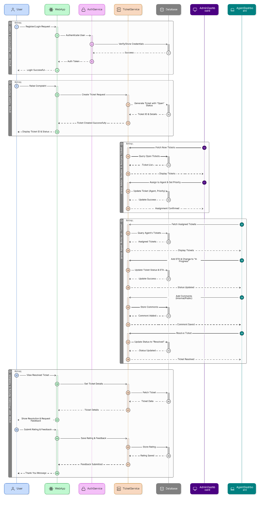
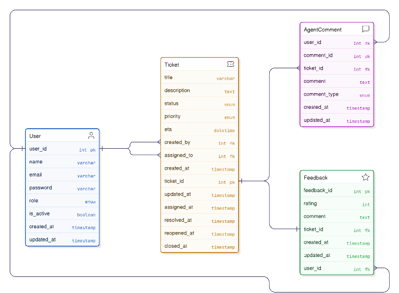

# **Project Planning Document (PPD)**

### **Project Title:** Complaint & Ticket Management System (CTMS)

### **Developer:** _Sarnick Chakraborty_

### **Submission Date:** _07.11.2025_

---

## **1. Project Overview**

The **Complaint & Ticket Management System (CTMS)** is a web-based platform designed to streamline the process of recording, tracking, and resolving user complaints or service requests within an organization.
Each complaint is converted into a **ticket** that passes through a defined workflow until it is resolved and closed.

This system aims to:

- Improve transparency and accountability.
- Track complaints efficiently.
- Ensure faster resolution through ticket assignment and monitoring.

---

## **2. Entities & Roles**

| Entity            | Can Do                                                                                                         |
| ----------------- | -------------------------------------------------------------------------------------------------------------- |
| **User**          | Register → Login → Raise Complaint → Track Ticket → View Status Updates → Give Feedback                        |
| **Admin**         | Login → Manage Users & Agents → View & Assign Tickets → Set Priority → Monitor Ticket Lifecycle                |
| **Support Agent** | Login → View Assigned Tickets → Add ETA → Update Status (In Progress / Resolved) → Add Comments → Close Ticket |

---

## **3. Work Flow**

1. **User registers & logs in**

   - Raises complaint → ticket auto-generated with Open status
   - User can view ticket in their dashboard

2. **Admin dashboard**

   - Sees new tickets
   - Assigns to agent and sets priority (Low/Medium/High)

3. **Agent dashboard**

   - Gets assigned ticket and adds ETA
   - Changes status: In Progress → Resolved
   - Adds internal or public comments

4. **User dashboard**

   - Sees real-time ticket updates and ETA
   - After Resolved → gives rating and feedback

5. **Admin can track performance**

   - Average resolution time, user ratings, ticket volume by status, etc.

---

## **4. Modules**

| Module                  | Description                                            | Actors Involved    | ETA (days) |
| ----------------------- | ------------------------------------------------------ | ------------------ | ---------- |
| **User Authentication** | Register, Login, Logout                                | User, Admin, Agent | 1          |
| **User Dashboard**      | Raise ticket, track status, view ETA                   | User               | 2          |
| **Admin Dashboard**     | View tickets, assign agents, set priority              | Admin              | 2          |
| **Agent Dashboard**     | View assigned tickets, update status, add ETA/comments | Agent              | 2          |
| **Feedback System**     | User feedback and ratings after resolution             | User               | 2          |

---

## **5. Entities and Relationships (ER Diagram)**

### **Entity Definitions**

#### **1. User**

| Attribute  | Type         | Description                          |
| ---------- | ------------ | ------------------------------------ |
| user_id    | INT (PK)     | Primary key, unique identifier       |
| name       | VARCHAR(100) | User's full name                     |
| email      | VARCHAR(255) | User's email (unique)                |
| password   | VARCHAR(255) | Encrypted password                   |
| role       | ENUM         | Role: employee, admin, support_agent |
| is_active  | BOOLEAN      | Account status (active/inactive)     |
| created_at | TIMESTAMP    | Account creation timestamp           |
| updated_at | TIMESTAMP    | Last update timestamp                |

**Relationships:**

- One-to-Many → Ticket (as employee: raises tickets)
- One-to-Many → Ticket (as support_agent: handles tickets)
- One-to-Many → Feedback (as employee: provides feedback)
- One-to-Many → AgentComment (as support_agent: adds comments)

---

#### **2. Ticket**

| Attribute   | Type         | Description                                   |
| ----------- | ------------ | --------------------------------------------- |
| ticket_id   | INT (PK)     | Primary key, unique identifier                |
| title       | VARCHAR(255) | Ticket title/subject                          |
| description | TEXT         | Detailed description of the issue             |
| status      | ENUM         | Status: Open, Assigned, In Progress, Resolved |
| priority    | ENUM         | Priority: Low, Medium, High (nullable)        |
| eta         | DATETIME     | Estimated time of resolution (nullable)       |
| created_by  | INT (FK)     | Foreign key referencing User (employee)       |
| assigned_to | INT (FK)     | Foreign key referencing User (support_agent)  |
| created_at  | TIMESTAMP    | Ticket creation timestamp                     |
| updated_at  | TIMESTAMP    | Last update timestamp                         |
| assigned_at | TIMESTAMP    | Timestamp when ticket was assigned (nullable) |
| resolved_at | TIMESTAMP    | Timestamp when ticket was resolved (nullable) |

**Relationships:**

- Many-to-One → User (created_by: employee who raised the ticket)
- Many-to-One → User (assigned_to: supportAgent handling the ticket)
- One-to-One → Feedback (One ticket can have one feedback)
- One-to-Many → AgentComment (One ticket can have multiple comments)

---

#### **3. Feedback**

| Attribute   | Type      | Description                             |
| ----------- | --------- | --------------------------------------- |
| feedback_id | INT (PK)  | Primary key, unique identifier          |
| rating      | INT       | Rating (1-5 scale)                      |
| comment     | TEXT      | User's feedback comment (nullable)      |
| ticket_id   | INT (FK)  | Foreign key referencing Ticket (unique) |
| user_id     | INT (FK)  | Foreign key referencing User (employee) |
| created_at  | TIMESTAMP | Feedback creation timestamp             |
| updated_at  | TIMESTAMP | Last update timestamp                   |

**Relationships:**

- One-to-One → Ticket (One feedback for one resolved ticket)
- Many-to-One → User (employee who provided feedback)

---

#### **4. AgentComment**

| Attribute    | Type      | Description                                 |
| ------------ | --------- | ------------------------------------------- |
| comment_id   | INT (PK)  | Primary key, unique identifier              |
| ticket_id    | INT (FK)  | Foreign key referencing Ticket              |
| user_id      | INT (FK)  | Foreign key referencing User (supportAgent) |
| comment      | TEXT      | Comment text (internal or public)           |
| comment_type | ENUM      | Type: Internal, Public                      |
| created_at   | TIMESTAMP | Comment creation timestamp                  |
| updated_at   | TIMESTAMP | Last update timestamp                       |

**Relationships:**

- Many-to-One → Ticket (Multiple comments for one ticket)
- Many-to-One → User (supportAgent who added the comment)

## **6. ER Diagram**

---

## **7. API Endpoints Design (Simplified)**

### **Authentication Routes**

| Method   | Endpoint           | Description              | Access        | Request Body                      | Response                     |
| -------- | ------------------ | ------------------------ | ------------- | --------------------------------- | ---------------------------- |
| **POST** | `/api/v1/register` | Register new user        | Public        | `{ name, email, password, role }` | `{ success, message, user }` |
| **POST** | `/api/v1/login`    | Login user/admin/agent   | Public        | `{ email, password }`             | `{ success, token, user }`   |
| **POST** | `/api/v1/logout`   | Logout current user      | Authenticated | -                                 | `{ success, message }`       |
| **GET**  | `/api/v1/profile`  | Get current user profile | Authenticated | -                                 | `{ success, user }`          |
| **PUT**  | `/api/v1/profile`  | Update user profile      | Authenticated | `{ name, email }`                 | `{ success, message, user }` |

---

### **Ticket Routes**

| Method     | Endpoint                            | Description                   | Access           | Request Body                | Response                        |
| ---------- | ----------------------------------- | ----------------------------- | ---------------- | --------------------------- | ------------------------------- |
| **POST**   | `/api/v1/tickets`                   | Create new ticket             | User             | `{ title, description }`    | `{ success, message, ticket }`  |
| **GET**    | `/api/v1/tickets`                   | Get all tickets               | Role-based       | -                           | `{ success, tickets }`          |
| **GET**    | `/api/v1/tickets/:id`               | View ticket details           | User/Admin/Agent | -                           | `{ success, ticket, comments }` |
| **PUT**    | `/api/v1/tickets/:id`               | Update ticket                 | Creator/Admin    | `{ title, description }`    | `{ success, message, ticket }`  |
| **DELETE** | `/api/v1/tickets/:id`               | Delete ticket                 | Admin            | -                           | `{ success, message }`          |
| **PUT**    | `/api/v1/tickets/:id/assign`        | Assign agent and set priority | Admin            | `{ assigned_to, priority }` | `{ success, message, ticket }`  |
| **PUT**    | `/api/v1/tickets/:id/update-status` | Change ticket status          | Agent            | `{ status }`                | `{ success, message, ticket }`  |
| **PUT**    | `/api/v1/tickets/:id/add-eta`       | Add/update ETA                | Agent            | `{ eta }`                   | `{ success, message, ticket }`  |
| **GET**    | `/api/v1/tickets/my-tickets`        | Get tickets created by user   | User             | -                           | `{ success, tickets }`          |
| **GET**    | `/api/v1/tickets/assigned-to-me`    | Get tickets assigned to agent | Agent            | -                           | `{ success, tickets }`          |

---

### **Comment Routes**

| Method     | Endpoint                       | Description                 | Access              | Request Body                | Response                        |
| ---------- | ------------------------------ | --------------------------- | ------------------- | --------------------------- | ------------------------------- |
| **POST**   | `/api/v1/tickets/:id/comments` | Add comment to ticket       | Agent               | `{ comment, comment_type }` | `{ success, message, comment }` |
| **GET**    | `/api/v1/tickets/:id/comments` | Get all comments for ticket | User/Admin/Agent    | -                           | `{ success, comments }`         |
| **PUT**    | `/api/v1/comments/:id`         | Update comment              | Agent (owner)       | `{ comment }`               | `{ success, message, comment }` |
| **DELETE** | `/api/v1/comments/:id`         | Delete comment              | Agent (owner)/Admin | -                           | `{ success, message }`          |

---

### **Feedback Routes**

| Method     | Endpoint                       | Description                | Access       | Request Body                     | Response                         |
| ---------- | ------------------------------ | -------------------------- | ------------ | -------------------------------- | -------------------------------- |
| **POST**   | `/api/v1/feedback`             | Submit feedback for ticket | User         | `{ ticket_id, rating, comment }` | `{ success, message, feedback }` |
| **GET**    | `/api/v1/feedback/:id`         | Get feedback by ID         | Admin/Agent  | -                                | `{ success, feedback }`          |
| **GET**    | `/api/v1/tickets/:id/feedback` | Get feedback for ticket    | Admin/Agent  | -                                | `{ success, feedback }`          |
| **PUT**    | `/api/v1/feedback/:id`         | Update feedback            | User (owner) | `{ rating, comment }`            | `{ success, message, feedback }` |
| **DELETE** | `/api/v1/feedback/:id`         | Delete feedback            | Admin        | -                                | `{ success, message }`           |

---

### **User Management Routes (Admin)**

| Method     | Endpoint                       | Description             | Access | Request Body                       | Response                     |
| ---------- | ------------------------------ | ----------------------- | ------ | ---------------------------------- | ---------------------------- |
| **GET**    | `/api/v1/users`                | Get all users           | Admin  | -                                  | `{ success, users }`         |
| **GET**    | `/api/v1/users/:id`            | Get user by ID          | Admin  | -                                  | `{ success, user }`          |
| **PUT**    | `/api/v1/users/:id`            | Update user details     | Admin  | `{ name, email, role, is_active }` | `{ success, message, user }` |
| **DELETE** | `/api/v1/users/:id`            | Delete user             | Admin  | -                                  | `{ success, message }`       |
| **PUT**    | `/api/v1/users/:id/activate`   | Activate user account   | Admin  | -                                  | `{ success, message, user }` |
| **PUT**    | `/api/v1/users/:id/deactivate` | Deactivate user account | Admin  | -                                  | `{ success, message, user }` |

---

### **Reports & Analytics Routes (Admin)**

| Method  | Endpoint                   | Description                 | Access | Request Body | Response                      |
| ------- | -------------------------- | --------------------------- | ------ | ------------ | ----------------------------- |
| **GET** | `/api/v1/reports`          | Get overall statistics      | Admin  | -            | `{ success, stats }`          |
| **GET** | `/api/v1/reports/tickets`  | Get ticket statistics       | Admin  | -            | `{ success, ticket_stats }`   |
| **GET** | `/api/v1/reports/agents`   | Get agent performance stats | Admin  | -            | `{ success, agent_stats }`    |
| **GET** | `/api/v1/reports/feedback` | Get feedback analytics      | Admin  | -            | `{ success, feedback_stats }` |

---

### **Dashboard Routes**

| Method  | Endpoint                  | Description              | Access | Request Body | Response                      |
| ------- | ------------------------- | ------------------------ | ------ | ------------ | ----------------------------- |
| **GET** | `/api/v1/dashboard/user`  | Get user dashboard data  | User   | -            | `{ success, dashboard_data }` |
| **GET** | `/api/v1/dashboard/agent` | Get agent dashboard data | Agent  | -            | `{ success, dashboard_data }` |
| **GET** | `/api/v1/dashboard/admin` | Get admin dashboard data | Admin  | -            | `{ success, dashboard_data }` |

---

## **9. Ticket Lifecycle**

| Step | Status      | Updated By | Example                |
| ---- | ----------- | ---------- | ---------------------- |
| 1    | Open        | System     | Created by user        |
| 2    | Assigned    | Admin      | Agent and Priority set |
| 3    | In Progress | Agent      | Work started           |
| 4    | Resolved    | Agent      | Problem fixed          |

---

## **10. Tech Stack**

| Layer               | Technology / Tool |
| ------------------- | ----------------- |
| **Frontend (FE)**   | React.js, Zustand |
| **Backend (BE)**    | ASP.NET Core 8    |
| **Database (DB)**   | PostgreSQL        |
| **Version Control** | Git, GitHub       |
| **Testing / API**   | Postman           |
